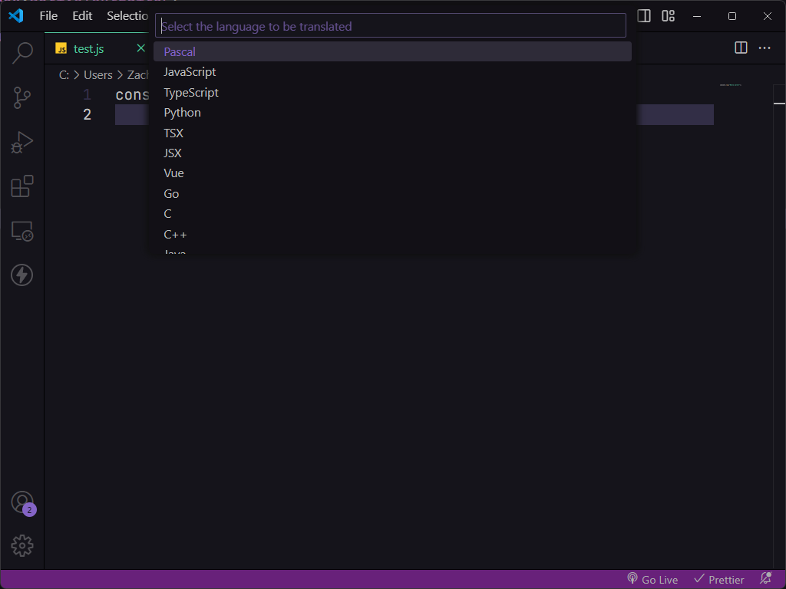

# AI Code Translator for VS Code 🚀

## Description 📝

The **AI Code Translator** is a powerful extension for Visual Studio Code that allows you to translate code from one programming language to another seamlessly. Whether you're learning a new language or working on a multi-language project, this tool can save you valuable time and effort!

## Features ✨

- **Easy Code Translation**: Quickly translate code snippets between various programming languages.
- **User-Friendly Interface**: Access the translator easily with a simple command.
- **Supports Multiple Languages**: Choose from a variety of programming languages for translation.

## How to Use 🛠️

1. Open Visual Studio Code.
2. Press `Ctrl + Shift + P` to open the command palette.
3. Type and select **Translate Code**.
4. Choose the desired target language for your code translation.

## Support 💬

If you encounter any issues or have questions, feel free to open an issue in the GitHub repository or contact the author.

---

Happy coding! 🎉

